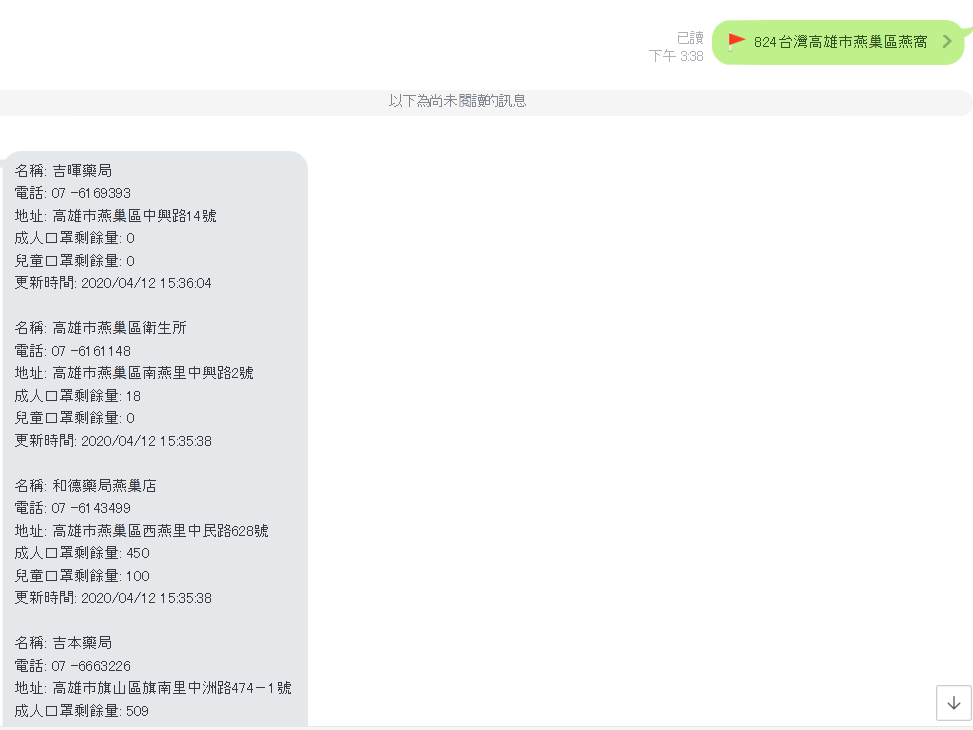

# 口罩機器人 Line-Bot

# 上傳日期 : 2020/04/06</h1>

## 需要的類別庫 :
* pip install apscheduler
* pip install line-bot-sdk
* pip install flask
* pip install json
* pip install requests
* pip install bs4
* pip install webbrowser
* pip install folium
* pip install geopy
* pip install configparser

## Example
#### 請使用Line預設的傳座標功能

