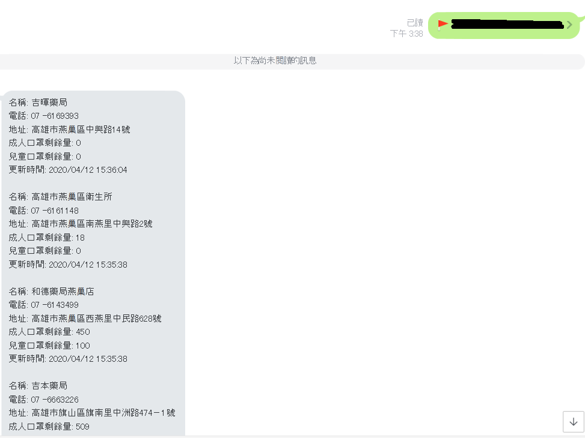

<h1>Name : Mask_Bot/口罩機器人</h1>

<h1>上傳日期/Update Time : 2020/04/06</h1>

<h1>Need's Lib:/需要的類別庫 :</h1>
<h4>pip install apscheduler,line-bot-sdk,flask,json,requests,bs4,webbrowser,foliumgeopy,geopy,configparser</h4>

